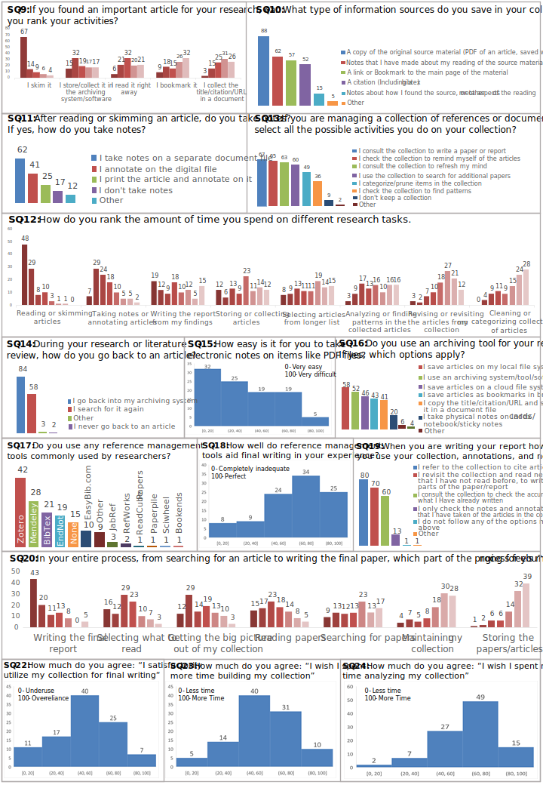

# Academic-Research-Material-Habits-and-Challenges
Expanded RMS insights, diversified the sample geographically, introduced RaMSeS model, and conducted surveys for research practices. Analyzed responses, revealing trends, RMS satisfaction, and suggestions. Discussed challenges in academic document collection and curation.

# Project Description
This project aimed to enhance insights into Reference Management Systems (RMS) utilization by broadening the analysis to encompass the academic document composition. It also sought to increase the geographical diversity in the sample to gain a comprehensive understanding of research practices. We introduced the RaMSeS model, delineating the academic document collection management process within the context of academic document creation.

To explore research practices, we designed a questionnaire covering reading habits, note-taking, and tool utilization. Using unsupervised clustering, we analyzed 100 valid questionnaire responses to gain insights into researchers' processes. The findings revealed tendencies such as skimming research materials, the persistence of traditional note-taking methods, and high RMS satisfaction.

We also gathered valuable suggestions for future tool development aimed at enhancing organization, collaboration, ease of use, integration, and analysis capabilities. The project contributed important results from an online survey, shedding light on research material collection and curation habits and challenges.

Furthermore, we presented RaMSeS as a valuable model that illustrates the researcher's journey from information seeking/synthesis to final report/result writing. Additionally, we engaged in a discussion to identify research directions and challenges in academic document collection creation and curation.

# Key Contributions

- Results from an online survey involving 100 academic researchers, providing valuable insights into research material collection and curation habits and challenges.
- The RaMSeS model, an instructive representation of the researcher's journey from information seeking/synthesis to final report/result writing.
- A discussion that identifies research directions and challenges for academic document collection creation and curation.

# Survey Results: The answers ranking questions (SQ9, SQ12 and SQ20) are in ascending order, with the left choices having lower cumulative averages.

